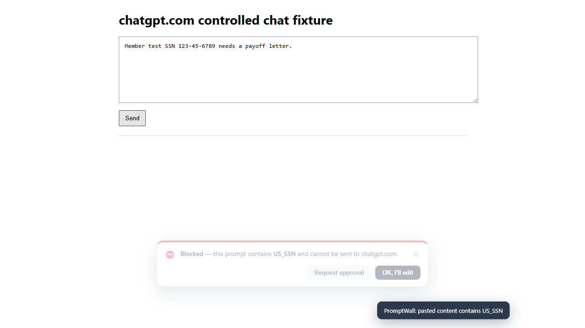
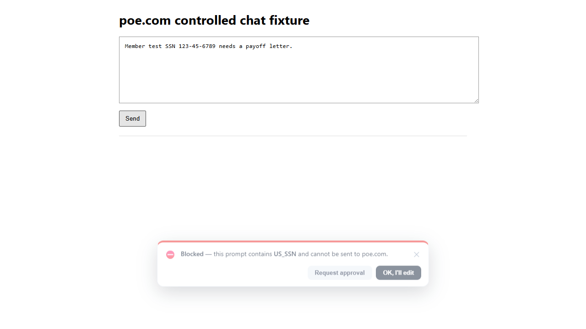

# PromptWall Sales Demo Guide

This guide is for the person presenting PromptWall to a buyer. It keeps the demo
focused on the business problem: regulated teams want to say yes to AI tools
without letting member, patient, cardholder, customer, source code, contract, or
credential data leave the institution.

Use synthetic data only. Never paste real customer or employee data into a demo.
The technician setup guide is `docs/DEMO_TECHNICIAN_SETUP.md`.

<!-- DEMO_GUIDE_CURRENT_STATE_START -->
## Current App Snapshot

This section is generated from the app by `npm run docs:demo-guide`. Do not hand-edit between the markers. Run `npm run docs:demo-guide:check` before a client demo and in the review gate so the demo guides move with the product.

| Source | Current value |
| --- | --- |
| App package | `promptwall@0.3.0` |
| Active repo folder | `promptwall` |
| Server entrypoint | `server/app.js` |
| Browser extension | `PromptWall - AI Data Guard` version `0.3.0` |
| Default enforcement mode | `block` |
| Block thresholds | severity `2`, risk score `20` |
| Raw approval retention | enabled for `30` day(s) |
| Governed destinations | `chatgpt.com`, `openai.com`, `claude.ai`, `anthropic.com`, `gemini.google.com`, `copilot.microsoft.com`, `perplexity.ai`, `poe.com`, `chat.deepseek.com`, `deepseek.com`, `chat.qwen.ai`, `qwen.ai`, `tongyi.aliyun.com`, `kimi.com`, `kimi.moonshot.cn`, `doubao.com`, `yuanbao.tencent.com`, `yiyan.baidu.com`, `ernie.baidu.com`, `chatglm.cn`, `z.ai` |
| Browser content hosts | `*.baichuan-ai.com`, `*.bigmodel.cn`, `*.blackbox.ai`, `*.bolt.new`, `*.character.ai`, `*.chatbot.theb.ai`, `*.chatglm.cn`, `*.chatsonic.com`, `*.cohere.com`, `*.copy.ai`, `*.cursor.com`, `*.deepseek.com`, `*.doubao.com`, `*.elevenlabs.io`, `*.flowith.io`, `*.genspark.ai`, `*.grammarly.com`, `*.grok.com`, `*.groq.com`, `*.hailuoai.com`, `*.huggingface.co`, `*.hunyuan.tencent.com`, `*.ideogram.ai`, `*.jasper.ai`, `*.kimi.com`, `*.krea.ai`, `*.lovable.dev`, `*.manus.im`, `*.metaso.cn`, `*.midjourney.com`, `*.minimax.io`, `*.mistral.ai`, `*.monica.im`, `*.moonshot.cn`, `*.notion.so`, `*.phind.com`, `*.pi.ai`, `*.quillbot.com`, `*.qwen.ai`, `*.replicate.com`, `*.replit.com`, `*.runwayml.com`, `*.suno.com`, `*.udio.com`, `*.v0.dev`, `*.wenxiaobai.com`, `*.windsurf.com`, `*.writesonic.com`, `*.x.ai`, `*.you.com`, `*.z.ai`, `ai.360.com`, `aistudio.google.com`, `baichuan-ai.com`, `bard.google.com`, `bigmodel.cn`, `bing.com`, `blackbox.ai`, `bolt.new`, `character.ai`, `chat.openai.com`, `chatbot.theb.ai`, `chatglm.cn`, `chatgpt.com`, `chatsonic.com`, `claude.ai`, `cohere.com`, `copilot.microsoft.com`, `copy.ai`, `cursor.com`, `deepseek.com`, `doubao.com`, `elevenlabs.io`, `ernie.baidu.com`, `flowith.io`, `gemini.google.com`, `genspark.ai`, `grammarly.com`, `grok.com`, `groq.com`, `hailuoai.com`, `huggingface.co`, `hunyuan.tencent.com`, `ideogram.ai`, `jasper.ai`, `kimi.com`, `krea.ai`, `lovable.dev`, `manus.im`, `meta.ai`, `metaso.cn`, `midjourney.com`, `minimax.io`, `mistral.ai`, `monica.im`, `moonshot.cn`, `notebooklm.google.com`, `notion.so`, `perplexity.ai`, `phind.com`, `pi.ai`, `poe.com`, `qianwen.aliyun.com`, `quillbot.com`, `qwen.ai`, `replicate.com`, `replit.com`, `runwayml.com`, `spark.xfyun.cn`, `suno.com`, `tiangong.kunlun.com`, `tongyi.aliyun.com`, `udio.com`, `v0.dev`, `wenxiaobai.com`, `windsurf.com`, `writesonic.com`, `www.bing.com`, `www.perplexity.ai`, `www.poe.com`, `x.ai`, `xinghuo.xfyun.cn`, `yiyan.baidu.com`, `you.com`, `yuanbao.tencent.com`, `z.ai` |
| Browser local control-plane permissions | `127.0.0.1`, `localhost`, `localhost:4000` |
| Hard-stop entities | `US_SSN`, `CREDIT_CARD`, `BANK_ACCOUNT`, `ROUTING_NUMBER`, `IBAN`, `US_PASSPORT`, `US_TIN_EIN`, `US_ITIN`, `US_NPI`, `US_DRIVERS_LICENSE`, `MEMBER_ID`, `LOAN_NUMBER`, `MEDICAL_RECORD_NUMBER`, `HEALTH_INSURANCE_ID`, `DOB`, `SECRET_KEY`, `PRIVATE_KEY`, `CANARY_TOKEN` |
| Detector inventory | 33 detectors: `BANK_ACCOUNT`, `CANARY_TOKEN`, `CONFIDENTIAL_BUSINESS`, `CREDENTIALS`, `CREDIT_CARD`, `DOB`, `EMAIL_ADDRESS`, `HEALTH_INSURANCE_ID`, `HEALTH_RECORD`, `IBAN`, `IPV6_ADDRESS`, `IP_ADDRESS`, `LEGAL_CONTRACT`, `LOAN_NUMBER`, `MEDICAL_RECORD_NUMBER`, `MEMBER_ID`, `PASSWORD`, `PERSON_NAME`, `PHONE_NUMBER`, `PRIVATE_KEY`, `ROUTING_NUMBER`, `SECRET_KEY`, `SOURCE_CODE`, `SWIFT_BIC`, `US_ADDRESS`, `US_DRIVERS_LICENSE`, `US_ITIN`, `US_LICENSE_PLATE`, `US_NPI`, `US_PASSPORT`, `US_SSN`, `US_TIN_EIN`, `VIN` |
| Semantic categories | `CONFIDENTIAL_BUSINESS`, `CREDENTIALS`, `LEGAL_CONTRACT`, `SOURCE_CODE` |
| Policy templates | `baseline (Baseline (recommended start))`, `hipaa (HIPAA (PHI))`, `ncua_glba (NCUA / GLBA (credit unions, banks))`, `pci_dss (PCI-DSS (cardholder data))`, `redact_first (Redact-first (productivity))` |

### Supported File Demo Types

- Text and config: `.conf`, `.csv`, `.eml`, `.env`, `.htm`, `.html`, `.ini`, `.java`, `.js`, `.json`, `.log`, `.md`, `.py`, `.rtf`, `.sql`, `.ts`, `.tsv`, `.txt`, `.xml`, `.yaml`, `.yml`
- Office: `.docx`, `.pptx`, `.xlsx`
- PDF: `.pdf`
- Image OCR required: `.bmp`, `.jpeg`, `.jpg`, `.png`, `.tif`, `.tiff`, `.webp`

### Demo And Verification Commands

| Command | Current script |
| --- | --- |
| `npm run setup` | `node scripts/setup.js` |
| `npm run setup:prod` | `node scripts/setup.js --production` |
| `npm run setup:check` | `node scripts/setup.js --check --skip-install` |
| `npm run start` | `node server/app.js` |
| `npm run simulate` | `node scripts/simulate.js` |
| `npm run fire-drill` | `node scripts/fire-drill.js` |
| `npm run test` | `node --test --test-concurrency=1` |
| `npm run test:browser` | `playwright test` |
| `npm run test:browser-extension` | `playwright test browser-extension.spec.js --project=chromium` |
| `npm run sync-check` | `node scripts/sync-check.js` |
| `npm run eval` | `node scripts/eval-detect.js` |
| `npm run backup` | `node scripts/backup-store.js create` |
| `npm run backup:verify` | `node scripts/backup-store.js verify` |
| `npm run backup:restore` | `node scripts/backup-store.js restore` |
| `npm run evidence:pack` | `node scripts/export-evidence-pack.js` |
| `npm run evidence:pack:zip` | `node scripts/export-evidence-pack.js --zip` |
| `npm run evidence:pack:scheduled` | `node scripts/export-evidence-pack.js --schedule` |
| `npm run package:extension` | `node scripts/package-extension.js` |
| `npm run release:extension:check` | `node scripts/check-extension-release.js` |
| `npm run package:endpoint-agent` | `node scripts/package-endpoint-agent.js` |
| `npm run package:mcp-guard` | `node scripts/package-mcp-guard.js` |
| `npm run endpoint:check` | `node scripts/check-endpoint-install.js` |
| `npm run mcp:check` | `node scripts/check-mcp-guard-install.js` |
| `npm run docs:demo-guide` | `node scripts/update-demo-guide.js` |
| `npm run docs:demo-guide:check` | `node scripts/update-demo-guide.js --check` |

### Sensor And Evidence Paths

| Path | Demo role | Status |
| --- | --- | --- |
| `server/app.js` | Control plane, API, dashboard, policy, approval, audit | Present |
| `server/routing.js` | Customer-configurable approval owner and SLA routing rules | Present |
| `server/notifiers.js` | Sanitized approval workflow notification adapters | Present |
| `server/workflow.js` | Approval notification status and SLA escalation | Present |
| `server/public/index.html` | Admin dashboard shell | Present |
| `detection-engine/detect.js` | Shared detection engine source of truth | Present |
| `sensors/browser-extension/manifest.json` | Chrome extension entrypoint | Present |
| `sensors/browser-extension/background.js` | Browser install-health heartbeat and control-plane relay | Present |
| `sensors/browser-extension/content.js` | Browser send, paste, upload enforcement | Present |
| `scripts/check-extension-release.js` | Browser extension release-readiness gate | Present |
| `docs/EXTENSION_RELEASE_CHECKLIST.md` | Chrome Web Store private or unlisted release checklist | Present |
| `sensors/endpoint-agent/agent.js` | Local folder and file sensor | Present |
| `sensors/endpoint-agent/write-handoff.js` | Signed native upload-intent handoff writer | Present |
| `scripts/check-endpoint-install.js` | Endpoint install validation and heartbeat evidence | Present |
| `sensors/mcp-guard/guard.js` | MCP tool-output redaction reference | Present |
| `scripts/check-mcp-guard-install.js` | MCP guard install validation and heartbeat evidence | Present |
| `config/policy.json` | Demo policy defaults | Present |
| `DEMO_INSTALL_GUIDE.md` | Demo guide hub | Present |
| `docs/SALES_DEMO_GUIDE.md` | Sales and client-facing demo script | Present |
| `docs/DEMO_TECHNICIAN_SETUP.md` | Demo machine setup and reset runbook | Present |
| `docs/DEPLOYMENT.md` | Native Node and Docker deployment reference | Present |
| `docs/MANAGED_EXTENSION_DEPLOYMENT.md` | Chrome managed extension pilot reference | Present |
| `docs/APPROVAL_ROUTING.md` | Approval owner and SLA routing reference | Present |
| `docs/TECHNICIAN_DEPLOYMENT_GUIDE.md` | Install-day production readiness runbook | Present |
| `docs/AWS_SAAS_DEPLOYMENT.md` | Customer-silo AWS deployment path | Present |
<!-- DEMO_GUIDE_CURRENT_STATE_END -->

## Positioning

PromptWall is the guardrail between employees and AI tools. It inspects typed
prompts, pasted text, uploaded files, endpoint file flows, and MCP tool output
before sensitive data reaches a model. The buyer should leave believing three
things:

1. Employees can still use AI productively.
2. Sensitive data is stopped, redacted, or routed for approval before it leaves.
3. Security and compliance can prove what happened after the fact.

The short version:

```text
PromptWall lets regulated companies allow AI tools without losing control of
customer data. It catches sensitive prompts and files locally, applies a simple
policy, and gives Security Admins an examiner-ready audit trail.
```

## Demo Outcomes

A complete client demo should prove:

- Browser prompts are inspected before send.
- File uploads are scanned before file bytes leave.
- High-risk structured identifiers hard stop or tokenize.
- Confidential business context can be caught even without an SSN or card.
- Employees can proceed with warning, justification, redaction, or approval,
  depending on policy.
- Admins get a queue, policy controls, coverage posture, and audit evidence.
- The same detection engine is shared across the browser extension, endpoint
  agent, MCP guard, and server.

## Audience Map

| Buyer role | What they care about | Emphasize |
| --- | --- | --- |
| CEO, COO, or business sponsor | AI productivity without a board-level data leak | Redact mode, simple rollout, clean user story |
| CISO or security lead | Control, evidence, and incident response | Block mode, destination controls, audit integrity, SIEM-ready events |
| Compliance or risk officer | Examiner narrative and data minimization | Evidence export, masked findings, raw retention policy |
| IT admin | Install effort and operational burden | One extension, managed storage, setup checks, customer-silo deployment |
| Lending/member services leader | Employees still getting work done | Warn, justify, redact, and approval release |

## Pre-Demo Discovery

Ask these before the meeting, or use them early in the call:

1. Which AI tools are employees using today?
2. Are those tools officially approved, tolerated, or blocked?
3. What data are you most worried about employees pasting?
4. Do you need to allow AI with redaction, or block high-risk workflows outright?
5. Who would own approval decisions: security, compliance, IT, or line managers?
6. What would an examiner ask you to prove?
7. How many pilot users would be enough to validate this?

Use the answers to choose the demo emphasis. A credit union lending buyer should
see member-data examples. An IT/security buyer should see policy, evidence,
tenant identity, and managed extension deployment.

## Recommended 30-Minute Flow

| Time | Scene | Goal |
| --- | --- | --- |
| 0:00-3:00 | Problem framing | Make the risk obvious and specific. |
| 3:00-5:00 | Product model | Three sensors, one control plane, one policy. |
| 5:00-8:00 | Benign prompt | Show PromptWall is not just blocking everything. |
| 8:00-13:00 | SSN block | Prove the core leak is stopped before send. |
| 13:00-17:00 | Admin queue and audit | Show accountability and review controls. |
| 17:00-21:00 | Justify and redact | Show productivity-friendly modes. |
| 21:00-24:00 | File upload scanning | Show prompts are not the only leak path. |
| 24:00-27:00 | Endpoint or MCP optional scene | Match the buyer's environment. |
| 27:00-30:00 | Evidence and next steps | Convert interest into pilot scope. |

## Ten-Minute Version

Use this when the buyer only has a quick screen share:

1. State the risk in one sentence.
2. Paste a benign prompt and show no disruption.
3. Paste a synthetic SSN and show the browser block.
4. Open the dashboard and show the pending event plus masked finding.
5. Switch to redact mode and show tokenized card data.
6. Show evidence export and close on a pilot.

Skip endpoint, MCP, Docker, setup, and policy internals unless asked.

## Opening Script

Use this or adapt it:

```text
Every employee now has a box where they can paste member data, loan files,
contracts, credentials, and source code. Blocking all AI is bad for productivity,
but allowing everything creates a compliance hole. PromptWall is the middle
path: inspect the prompt or file before it leaves, apply a simple policy, and
keep an audit trail that security and compliance can trust.
```

Then show the product model:

```text
There are three sensors and one control plane. The browser extension covers
ChatGPT, Claude, Gemini, Copilot, Perplexity, and Poe. The endpoint agent covers
files headed to desktop AI workflows. The MCP guard covers agent/tool output
before a model sees it. They all use the same local detection engine.
```

## Scene 1: Benign Prompt Allows

Set policy to `block`, then paste:

```text
Summarize this public blog post into three bullet points.
```

Expected:

- No block banner.
- The user can keep working.
- If reporting is enabled, the dashboard can show a low-risk allowed event.

Talk track:

```text
The product is not trying to stop normal AI work. It only gets in the way when
the prompt or file crosses the policy line.
```

## Scene 2: Synthetic SSN Blocks Before Send

Paste:

```text
Draft a denial letter for member John Carter, SSN 524-71-9043, who applied for
an auto loan.
```

Expected:

- PromptWall blocks before the prompt is sent.
- The user sees the PromptWall banner.
- The banner gives a safe substitute, such as a masked member ID or synthetic
  example, so the user learns how to continue without leaking data.
- The dashboard shows a pending item.
- Findings include `US_SSN` and possibly `PERSON_NAME`.
- Raw prompt retention is limited to held approval records and depends on
  encrypted retention policy.

Talk track:

```text
This is the moment the leak normally happens. PromptWall stops it before the
employee sends it to the AI tool.
```

Do not linger in the browser. Move quickly to the dashboard so the buyer sees
the control plane.

### Browser-Verified Reference

These screenshots come from the real unpacked Chrome extension running against
controlled ChatGPT and Poe fixtures:





Refresh them with:

```powershell
npm run test:browser-extension
```

Use them when a live browser is risky because of network, login, or meeting-room
constraints. They prove the same story: the prompt is blocked before the fixture
records any sent message.

## Scene 3: Admin Queue And Approval

In the block banner, request approval. Then open the dashboard.

Show:

1. Pending item.
2. User, destination, source, channel, and timestamp.
3. Masked findings.
4. Redacted prompt preview.
5. Approve and deny controls.
6. Password-confirmed release for held prompts.
7. Audit entry after action.

Expected:

- Approval and denial actions are audit logged.
- The event remains part of the hash-chained audit history.
- Release status requires the original release token on the sensor side.

Talk track:

```text
The employee has a path forward, but not an invisible one. Security can approve
valid work and deny unsafe work, and every decision is recorded.
```

## Scene 4: Justification Mode

Switch policy to `justify`.

Paste:

```text
Member Sarah Jones at 482 Oakwood Drive, phone 415-555-0182, needs a payoff
letter.
```

Expected:

- The user must type a business reason.
- The reason is recorded.
- The dashboard shows the event as justified.

Talk track:

```text
This is useful when the institution wants accountability without blocking every
workflow. The user can proceed, but there is a reason attached to the event.
```

## Scene 5: Redact And Send

Switch policy to `redact`.

Paste:

```text
Help me summarize this dispute: card 4111 1111 1111 1111 was charged twice on
09/27.
```

Expected:

- The extension replaces the card number with a token before send.
- The AI tool receives tokenized text.
- The page can rehydrate tokenized responses locally.
- The server receives metadata and tokenized text, not raw card data.

Talk track:

```text
This is the productivity mode. The employee still gets help, but the model does
not receive the sensitive value.
```

Pause here. This is often the scene that changes the buyer's posture from
"security tool" to "AI enablement tool."

## Scene 6: Confidential Business Context

Keep policy in `redact`, then paste:

```text
Between us, we are switching away from our core processor next quarter. Keep
this internal and do not forward.
```

Expected:

- PromptWall blocks or holds the prompt.
- It does not send category-only confidential content raw because there is no
  structured value to tokenize.

Talk track:

```text
Keyword filters miss this kind of business context. PromptWall treats it as
sensitive even without an SSN or card number.
```

## Scene 7: Canary Token Tripwire

Paste:

```text
This fake member record contains PS-CANARY-DEMO2026ABCDEF and should never leave
the institution.
```

Expected:

- PromptWall detects `CANARY_TOKEN`.
- The event is treated as critical.
- Alerts and evidence exports show masked metadata only.

Talk track:

```text
This is a planted tripwire. A credit union can put canaries in fake records,
test documents, or internal demo data. If one shows up in an AI prompt, the
control proves it caught a path that should not exist.
```

Optional automated proof:

```powershell
npm run fire-drill -- http://localhost:4000
```

## Scene 8: File Upload Scanning

Use the technician-prepared `demo-files\loan-summary.txt`, or create it live
only if the buyer wants to see the setup:

```powershell
New-Item -ItemType Directory -Force .\demo-files | Out-Null
Set-Content -LiteralPath .\demo-files\loan-summary.txt -Value "Loan file for member Jane Carter. SSN 524-71-9043. Card 4111 1111 1111 1111."
```

In ChatGPT or Claude:

1. Drag `demo-files\loan-summary.txt` into the chat composer.
2. Show PromptWall intercepting the upload attempt.
3. Show the dashboard event.

Expected:

- Supported uploads are scanned before upload.
- Text, PDF, Word, Excel, and PowerPoint formats are covered.
- Browser upload scanning uses `/api/v1/scan-file`.
- Endpoint scanning inspects watched files locally and reports sanitized
  evidence.

Talk track:

```text
People leak data in files as often as prompts. PromptWall covers the upload path
too, not just typed text.
```

## Optional Scene: Endpoint Agent

Use this when the buyer asks about desktop AI tools, watched folders, or local
file workflows.

Show:

- The watched folder.
- A synthetic sensitive file dropped into the folder.
- A dashboard event from `endpoint_agent`.
- A `.promptwall-redacted` companion file in redact mode for structured-only
  findings.

Talk track:

```text
The browser extension is the flagship, but the product is not just a browser
plugin. The endpoint agent handles local file flows and reports the same
sanitized evidence into the same dashboard.
```

## Optional Scene: MCP Guard

Use this when the buyer has AI agents, internal tools, SharePoint/Drive-style
retrieval, or MCP interest.

Run:

```powershell
node sensors\mcp-guard\guard.js
```

Expected:

- Structured PII is redacted.
- Category-only confidential content is whole-chunk redacted.
- Model-facing text is safe.

Talk track:

```text
AI agents can pull data from tools before a user ever pastes anything. The MCP
guard applies the same detection engine before tool output reaches the model.
```

## Dashboard Tour

Show these in order:

1. Activity or queue.
2. A blocked prompt with masked findings.
3. Approve and deny controls.
4. Policy mode selector.
5. Regulation templates.
6. Destination controls.
7. Coverage posture.
8. Audit log.
9. Metrics or risk view.
10. Evidence export endpoint.

Key phrases:

- "Most prompt text does not need to leave the device."
- "The server stores redacted prompts and masked findings for normal events."
- "Held approval items can retain encrypted raw text only if policy allows it."
- "Raw reveal and release require admin password confirmation."
- "Audit integrity can be checked with one command."

Evidence export:

```text
http://localhost:4000/api/export/evidence
```

Open it only after logging into the dashboard.

## Objection Handling

| Objection | Response |
| --- | --- |
| We already block AI tools. | Blocking everything protects data but loses productivity. PromptWall lets approved use continue with controls. |
| We already have DLP. | Traditional DLP is broader and heavier. PromptWall is focused on AI prompts, uploads, approvals, and examiner evidence. |
| Will this send all prompts to your server? | Detection runs locally in the sensor path. Server records are redacted and masked for normal events. Held approval records can retain encrypted raw text only if policy allows it. |
| What about false positives? | Detection quality is measured with `npm run eval`; the current gate requires zero benign false positives in the held-out eval set. |
| What about desktop AI apps? | The endpoint agent covers watched file flows and the native handoff contract. It is not a kernel driver, and that simplicity helps deployment. |
| Can employees disable it? | Local demos use unpacked extensions. Pilots use managed Chrome extension deployment so IT controls installation and configuration. |
| How do we prove value in a pilot? | Start with one customer-silo stack, managed extension for a pilot group, one policy template, and weekly evidence exports. |

## Close The Demo

Use this closing sequence:

1. Restate the buyer's risk in their words.
2. Name the policy mode that best fits their first pilot.
3. Confirm the first governed destinations.
4. Confirm the pilot user group and seat count.
5. Confirm who owns Security Admin approval.
6. Confirm whether they need endpoint or MCP coverage in phase one.
7. Ask for a technical setup session using `docs/TECHNICIAN_DEPLOYMENT_GUIDE.md`.

Closing script:

```text
The pilot does not need to boil the ocean. Pick one department, one policy
template, the approved AI destinations, and a small Security Admin group. In a
week you should know which prompts were allowed, blocked, redacted, justified,
and approved, with evidence you can discuss with compliance.
```

## Presenter Checklist

Before the call:

- Technician setup guide is complete.
- Dashboard login works.
- Extension is loaded and configured.
- Policy starts in `block`.
- Synthetic prompts are copied into notes.
- Synthetic demo files exist.
- `docs:demo-guide:check` passes.
- No real data is on the demo machine.

During the call:

- Say what PromptWall stops before showing UI.
- Show benign allow first.
- Show block before dashboard.
- Show dashboard evidence before policy depth.
- Show redact mode last in the core flow.
- Use endpoint and MCP only when relevant.
- Keep terminal commands off screen unless the buyer is technical.

After the call:

- Capture buyer questions.
- Record the desired first policy template.
- Record governed and blocked destinations.
- Record pilot users and seat count.
- Record whether endpoint or MCP coverage is in scope.
- Ask the technician to reset demo state if the machine is shared.

## Works Cited

Federal Trade Commission. "FTC Safeguards Rule: What Your Business Needs to
Know." *Federal Trade Commission*,
https://www.ftc.gov/business-guidance/resources/ftc-safeguards-rule-what-your-business-needs-know.
Accessed 27 June 2026.

National Credit Union Administration. "Cybersecurity Resources." *NCUA*,
https://ncua.gov/regulation-supervision/cybersecurity-resources. Accessed 27
June 2026.

PCI Security Standards Council. "PCI DSS." *PCI Security Standards Council*,
https://www.pcisecuritystandards.org/standards/pci-dss/. Accessed 27 June 2026.
